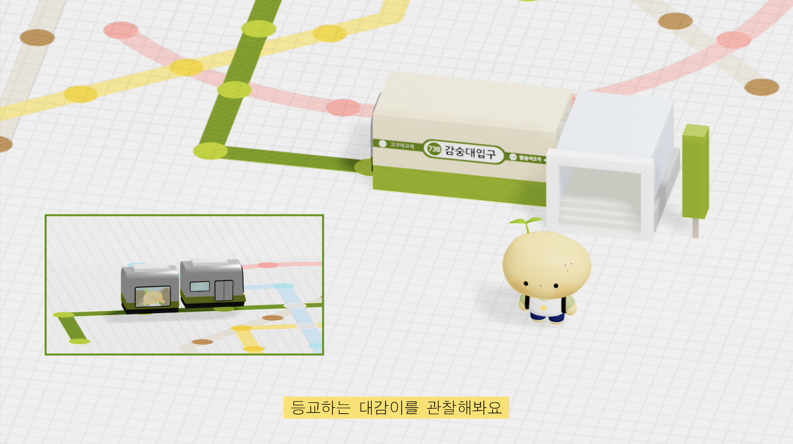
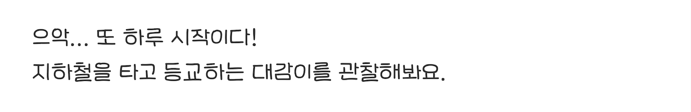
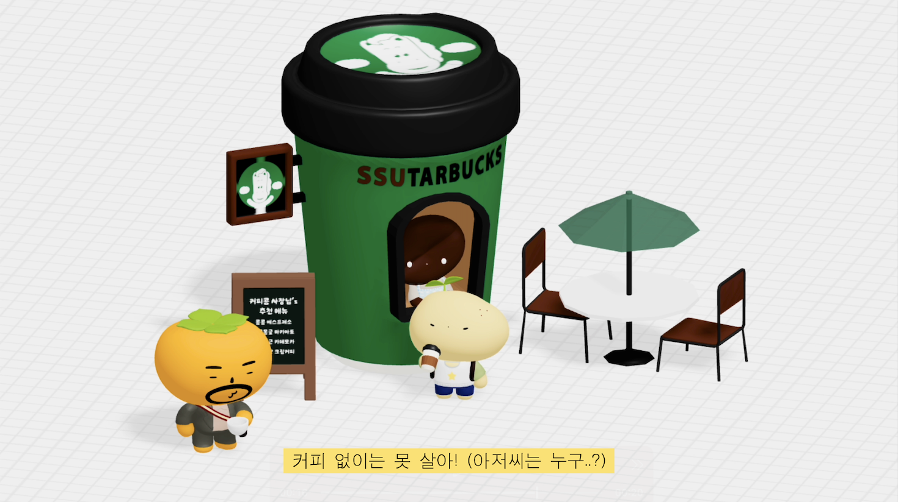
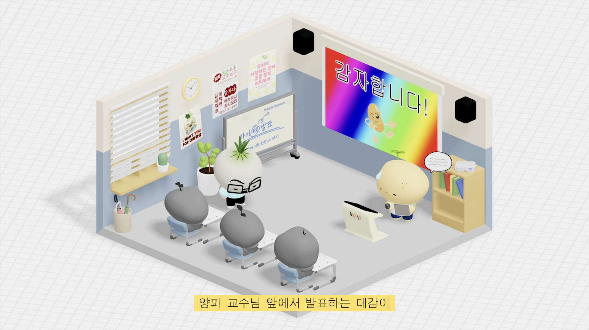
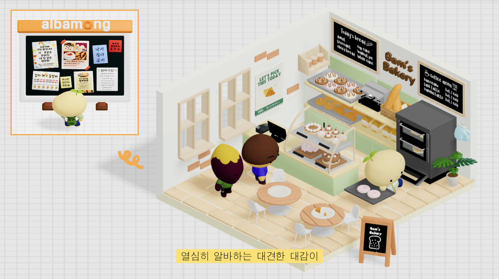
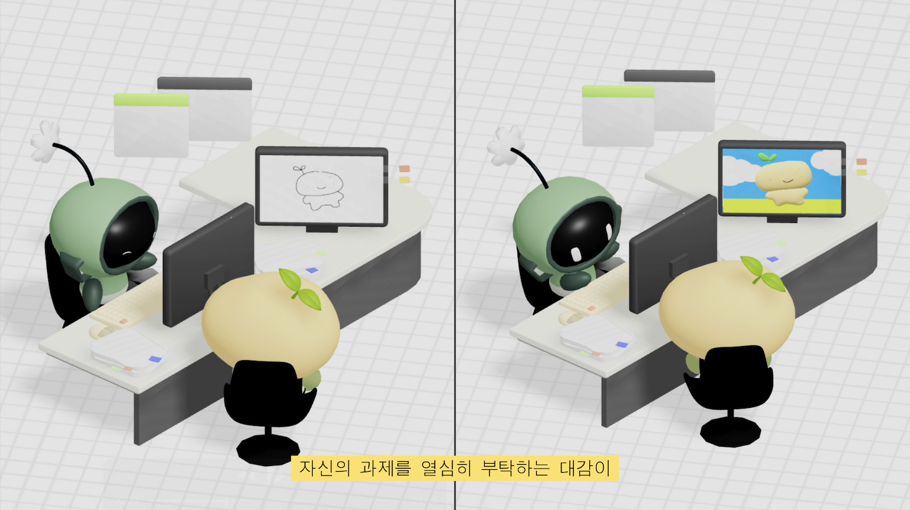
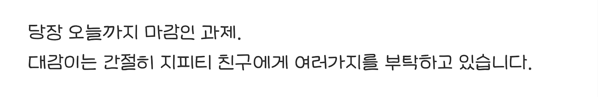
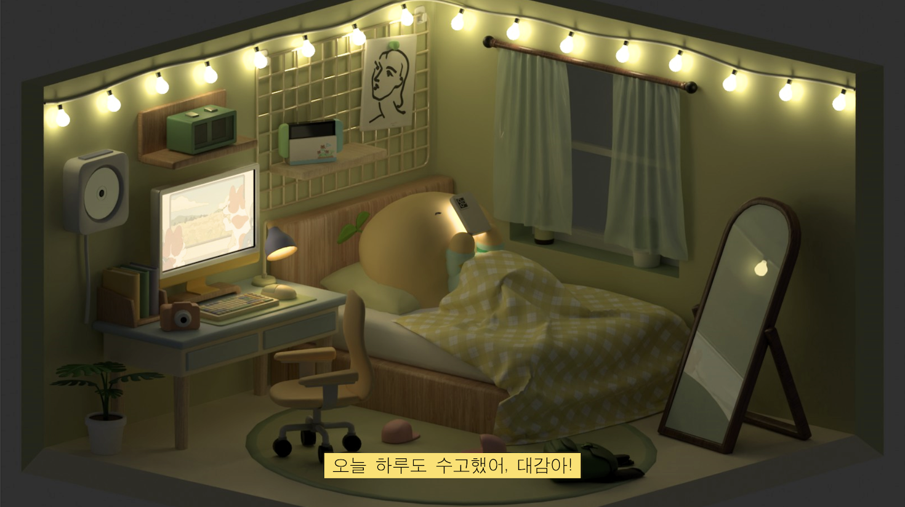

<!-- ---
layout: project_page
permalink: /
title: "나는야 말하는 감자"
presentation: "글로벌미디어 2025 졸업전시회"
team: "움트 Oummt"
authors:
  - Heesun Park *
  - Dayeon Lee *
  - Yunji Lee
affiliations:
  - Soongsil University
paper: ""
video: ""
code: "https://le2yunji.github.io/oummt.github.io/"
data: "https://github.com/your-repo/dataset"
--- -->

<body>
  

  
</body>
<!-- 

  

    <h2>Abstract</h2>
    

      나는야 말하는 감자!  스스로를 ‘감자’라 부르며 웃픈 대학생활을 버텨봤나요?   대학생 감자 ‘대감이’의 좌충우돌 하루를 담은 인터랙티브 콘텐츠를 준비했어요!   소소한 일상 속에서 공감과 담담한 위로를 느끼며, 대감이와 함께 귀여운 휴식을 즐겨보세요!
    

    

      
      
    

    

      
      
    

    

      
      
    

    

      
      
    

    

      
      
    

    

      
      
    

  

 -->

<!-- Dataset Download Buttons -->
<!-- 
## SIDL Dataset 
We provide 80% of the scenes for training and learning. The remaining scenes are used for online evaluation.
### Patchify images (512x512)
For efficient training and learning, we provide patchified images. 

  <a class="button is-primary" href="https://drive.google.com/file/d/1es3rPo5Y9O96EjDVXanUY8NpaRprWH-h/view?usp=sharing" target="_blank">Train</a>
  <a class="button is-primary" href="https://drive.google.com/file/d/1u5-MDauO3XolXsU6eOARwlXo7SnpLwqA/view?usp=sharing" target="_blank">Validation</a>
  <a class="button is-primary" href="https://drive.google.com/file/d/1-SFyyjH0G3C68OfDjZ_O7M4mOqkcJdEf/view?usp=sharing" target="_blank">Test</a>

### Full-resolution images (4032x3024)

  <a class="button is-primary" href="https://drive.google.com/file/d/1s_gUw1DCqokihl3YtO3lu9_GnLZaSElI/view?usp=sharing" target="_blank">Train</a>
  <a class="button is-primary" href="https://drive.google.com/file/d/1OHxG8Jh0goKIhkJTe9NXZ6uIuD5qVaNH/view?usp=sharing" target="_blank">Validation</a>

### RAW files
We also provide RAW image files (DNG) along with metadata.

  <a class="button is-primary" href="https://drive.google.com/file/d/1k78IIsUl2eYPnPvWkBampU0qlMrW4F-u/view?usp=sharing" target="_blank">DNG images</a>
  <a class="button is-primary" href="https://drive.google.com/file/d/1lAab5F3jjCByY4OEvGSAfykyAqp2wfTi/view?usp=sharing" target="_blank">Metadata</a>

### Online Evaluation  

  <a class="button is-primary" href="http://203.253.25.170:8080" target="_blank">Click here to launch evaluation</a>

  
Click the button above to evaluate your model on the SIDL benchmark. -->

<!-- 
### ISP pipeline
Coming soon -->

